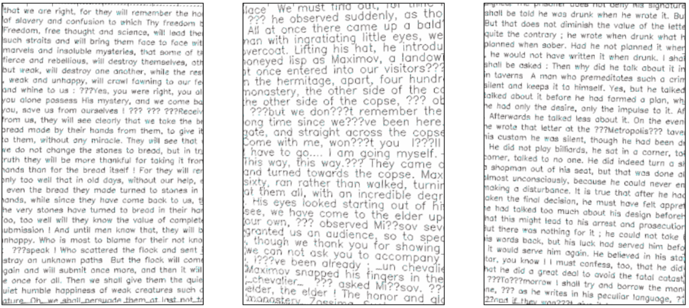
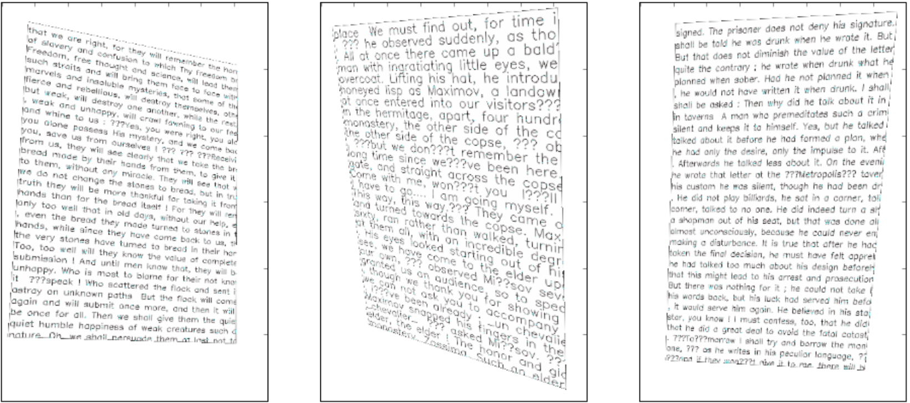

# Images_shear

   This is a project where I try to predict images' deformations. Each input image with 
   generated text into it is deformed in different ways. And my purpose is to build a tensorflow
   model which would be capable to predict 8 deformation values(each angle has 2 coordinates so
   if we shift all angles --> 8 values are changed).
# Input data:
  * Training set has 10000 images
  * Image size 400x600
  * Each input image has text into it
  * The size of text letters ranges from 1 to 3
  * The fond of text letters can be one of three types
  * All input images are deformed: each angle is shifted inward along the sides of the image.A shift value ranges from 0 to 0.2 of the width and height of the initial image.
  * Model and training set generator must be defined in individual files to be readable
  
  
  
# Results:
 * In Data_generator notebook you can see training examples [here](https://github.com/NevzaimnayaLove/images_shear/blob/master/Data_generator.ipynb)
 * In Model notebook you can see a Tensorflow model with its results on training,validation and test sets [here](https://github.com/NevzaimnayaLove/images_shear/blob/master/Model.ipynb)
 * Visualised restored images
 
 
  
